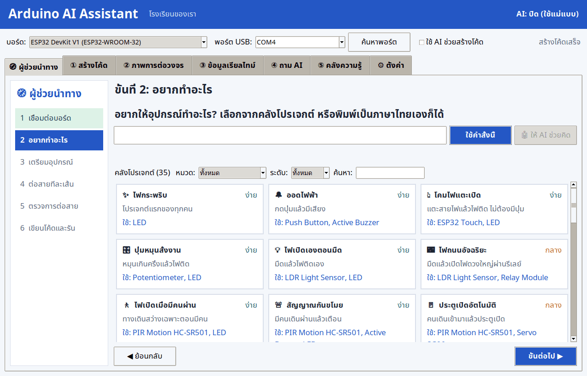
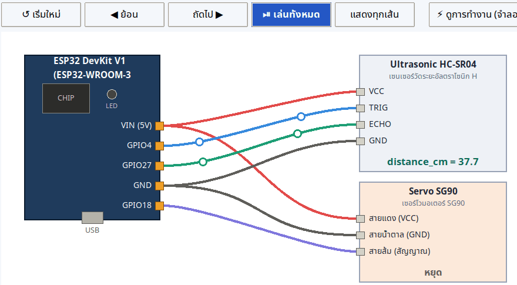
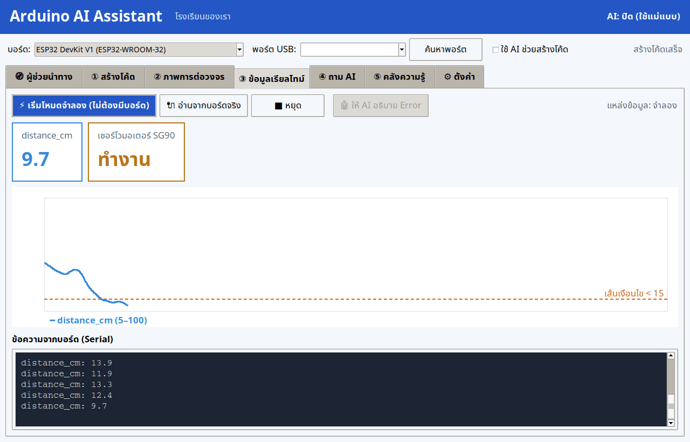

# Arduino AI Assistant — ผู้ช่วย AI สำหรับเรียนไมโครคอนโทรลเลอร์

## เอกสารฉบับภาพ (สำหรับนักเรียนที่มีความบกพร่องทางการได้ยิน)

| เอกสาร | เนื้อหา |
|---|---|
| [คู่มือติดตั้งโปรแกรม ฉบับภาพ (PDF 8 หน้า)](docs/install-guide-visual-th.pdf) | ติดตั้ง Python, แตกไฟล์, ติดตั้งโปรแกรม, ลง MicroPython, ต่อบอร์ด, แก้ปัญหา |
| [รู้จักระบบ ฉบับภาพ (PDF 11 หน้า)](docs/system-guide-visual-th.pdf) | การทำงานของระบบ, ผู้ช่วยนำทาง 6 ขั้น, อ่านภาพวงจร, ข้อมูลเรียลไทม์, กฎความปลอดภัย, คำศัพท์ |

| ภาพการต่อวงจรแบบเคลื่อนไหว | ข้อมูลเรียลไทม์ |
|---|---|
|  |  |

> **ความปลอดภัย:** ไฟล์ `config.json` เก็บ API Key ของครู ห้ามอัปโหลดขึ้น GitHub (มีอยู่ใน `.gitignore` แล้ว)

**เวอร์ชัน 2.0 (25 ก.ย. 2569)**

โปรแกรมรับคำสั่งภาษาไทย แล้วสร้างโค้ด **MicroPython** ให้บอร์ด ESP32, Raspberry Pi Pico และ Arduino รุ่นที่รองรับ
(ส่วน Arduino Uno / Nano / Mega จะได้โค้ด C++ แทน เพราะชิปเล็กเกินกว่าจะรัน Python)
พร้อม **ภาพเคลื่อนไหวการต่อวงจร** และ **ภาพการทำงานแบบเรียลไทม์**

## 1. ติดตั้ง (ทำครั้งเดียว)

1. ติดตั้ง Python 3.10 ขึ้นไปจาก python.org (ติ๊ก "Add Python to PATH" ตอนติดตั้ง)
2. ดับเบิลคลิก `install.bat` (หรือพิมพ์ `pip install -r requirements.txt`)
3. ดับเบิลคลิก `run.bat` (หรือพิมพ์ `python app.py`) เพื่อเปิดโปรแกรม

### ถ้าขึ้น Error ว่า "Non-ASCII character ... no encoding declared"

แปลว่าเครื่องมี Python 2 รุ่นเก่า ให้ติดตั้ง Python 3 เพิ่ม (ไม่ต้องลบ Python 2) ไฟล์ `run.bat` จะเลือก Python 3 ให้เอง
ถ้าพิมพ์คำสั่งเอง ให้ใช้ `py -3 app.py` แทน `python app.py`

## 2. ลง MicroPython ในบอร์ด (ทำครั้งเดียวต่อบอร์ด)

- **ESP32 ทั่วไป / Pico:** เปิดโปรแกรม Thonny → Tools → Options → Interpreter → "Install or update MicroPython"
- **Arduino Nano ESP32 / Nano RP2040 Connect:** ใช้ Arduino MicroPython Installer
- หลังลงเฟิร์มแวร์แล้ว ปิด Thonny ก่อนใช้โปรแกรมนี้ (ใช้พอร์ตพร้อมกันไม่ได้)

## 3. วิธีใช้

เปิดโปรแกรมแล้วจะเจอแท็บ **🧭 ผู้ช่วยนำทาง** ก่อน ทำตาม 6 ขั้นได้เลย:

1. **เชื่อมต่อบอร์ด** — เสียบ USB แล้วกด "ตรวจบอร์ด" โปรแกรมบอกรุ่นชิป เฟิร์มแวร์ และอุปกรณ์ I2C (เช่นจอ OLED) ที่ต่ออยู่
2. **อยากทำอะไร** — เลือกจากคลังโปรเจกต์ 35 แบบ (กรองตามหมวดและระดับได้) หรือพิมพ์เอง หรือกด "ให้ AI ช่วยคิด"
3. **เตรียมอุปกรณ์** — รายการของที่ต้องใช้พร้อมรูป และอุปกรณ์เสริมเช่นตัวต้านทาน
4. **ต่อสายทีละเส้น** — ดูแอนิเมชันทีละเส้น ต่อตามแล้วกดยืนยันเส้นต่อไป เส้นปัจจุบันจะหนาเป็นพิเศษ
5. **ตรวจการต่อสาย** — โปรแกรมส่งโค้ดทดสอบสั้น ๆ ไปรันบนบอร์ดจริงทีละอุปกรณ์ บอกว่าผ่านหรือไม่ผ่าน พร้อมสาเหตุเป็นภาษาไทย
6. **เขียนโค้ดและรัน** — ได้โค้ด MicroPython รันบนบอร์ดจริง แล้วดูกราฟและภาพการทำงานแบบเรียลไทม์

แท็บอื่น ๆ:

| แท็บ | ทำอะไร |
|---|---|
| ① สร้างโค้ด | พิมพ์คำสั่งภาษาไทย กดสร้างโค้ด ดูการต่อสายและคำเตือน กดรันหรืออัปโหลดลงบอร์ด **เปิดไฟล์โค้ด .py / .ino ของตัวเอง** และ **เก็บโค้ดไว้ในคลังโค้ดของฉัน** ได้ |
| ② ภาพการต่อวงจร | ดูสายค่อย ๆ ต่อทีละเส้นพร้อมคำบรรยาย กด "ดูการทำงาน" เพื่อดูจุดข้อมูลวิ่งบนสาย |
| ③ ข้อมูลเรียลไทม์ | กราฟและตัวเลขสด จากบอร์ดจริงหรือโหมดจำลอง (ไม่ต้องมีบอร์ด) |
| ④ ถาม AI | ถามเรื่องบอร์ดและเซนเซอร์ ถ้าไม่เปิด AI จะตอบจากคลังความรู้ |
| ⑤ คลังความรู้ | ข้อมูลบอร์ด 14 รุ่น อุปกรณ์ 33 ชนิด ขา แรงดัน คำเตือน **เพิ่มรูปและเพิ่มอุปกรณ์ใหม่ได้จากหน้าจอ** |
| ⚙ ตั้งค่า | ตั้งชื่อ AI ของคุณ ชื่อโรงเรียน และเลือกสมอง AI |

ปุ่ม **▶ รันบนบอร์ด** รันโค้ดทันทีโดยไม่บันทึก เหมาะกับการทดลอง
ปุ่ม **⬆ อัปโหลดเป็น main.py** บันทึกลงบอร์ด เสียบไฟครั้งต่อไปบอร์ดจะทำงานเอง

## 4. สมอง AI (เลือกได้ในแท็บตั้งค่า)

- **ไม่ใช้ AI:** ใช้แม่แบบที่ตรวจแล้ว ทำงานออฟไลน์ ผลแน่นอนทุกครั้ง
- **Claude API:** สมัครที่ console.anthropic.com แล้วนำ API Key มาใส่ ต้องมีอินเทอร์เน็ต มีค่าใช้จ่ายตามการใช้งาน
- **Ollama:** ติดตั้งจาก ollama.com แล้วพิมพ์ `ollama pull qwen2.5-coder:7b` ฟรีและออฟไลน์ แต่ต้องใช้คอมพิวเตอร์สเปกดี

ไม่ว่าเลือกแบบไหน โปรแกรมจะส่งข้อมูลจากคลังความรู้ไปให้ AI ด้วยทุกครั้ง (RAG) และตรวจเลขขาในโค้ดที่ AI เขียนอีกรอบ

## 5. ใส่รูปบอร์ดและอุปกรณ์

**วิธีง่ายที่สุด:** แท็บคลังความรู้ → เลือกอุปกรณ์ → กด "🖼 เพิ่ม / เปลี่ยนรูป" → เลือกรูปจากเครื่อง (ใช้รูป .jpg จากมือถือได้เลย โปรแกรมย่อและแปลงให้)

ถ้ามีรูปหลายรูป ใส่ทีเดียวได้ตามนี้:

1. เปิดไฟล์ `images/photo_list.txt` (รายชื่อรูปที่ต้องถ่าย) ดูชื่อไฟล์ของแต่ละอุปกรณ์
2. ถ่ายรูปด้วยมือถือ แล้วคัดลอกลงโฟลเดอร์ `images` ตั้งชื่อตามรายชื่อ เช่น `hc-sr04.jpg`
3. ดับเบิลคลิก `prepare_images.bat` (หรือพิมพ์ `python prepare_images.py`) โปรแกรมจะย่อรูป แปลงเป็น .png และบอกว่ายังขาดรูปอะไร
4. เปิดโปรแกรมใหม่ รูปจะขึ้นในแท็บคลังความรู้

## 6. เพิ่มอุปกรณ์ใหม่ในคลังความรู้

**วิธีง่ายที่สุด:** แท็บคลังความรู้ → กด "➕ เพิ่มอุปกรณ์ใหม่" → กรอกฟอร์ม (มีตัวอย่างเซนเซอร์ BH1750 ให้ดู) → กด "🧪 ทดลองสร้างโค้ด" → กด "บันทึก"
โปรแกรมจะทดลองสร้างโค้ดก่อนบันทึก ถ้าโค้ดผิดจะไม่บันทึก คลังความรู้จึงไม่เสีย

หรือแก้ไฟล์ `knowledge/components.json` เพิ่มอุปกรณ์ 1 ชุด ช่องสำคัญ:

| ช่อง | ความหมาย |
|---|---|
| `keywords` | คำที่นักเรียนอาจพิมพ์ เช่น `["servo", "เซอร์โว"]` |
| `type` | `sensor` (อ่านค่า), `actuator` (สั่งงาน), `display` (จอ), `info` (มีแค่ข้อมูล) |
| `pins` | ขาของอุปกรณ์ `kind` = `power5`, `power3`, `gnd`, `signal` และ `need` = `out`, `inp`, `adc`, `pwm`, `i2c_sda`, `i2c_scl` |
| `setup`, `read`, `on`, `off` | โค้ด MicroPython ใช้ `{SIG}` แทนเลขขา โปรแกรมจะเลือกขาให้เอง |
| `keys` | ชื่อค่าที่ print ออกมา ใช้ทำกราฟเรียลไทม์ |
| `warnings` | คำเตือนที่ต้องแสดงทุกครั้ง |

แล้วรัน `py -3 test_generator.py` เพื่อตรวจว่าโค้ดที่สร้างยังถูกต้อง

### เพิ่มโปรเจกต์ในคลังโปรเจกต์

แก้ไฟล์ `knowledge/projects.json` แต่ละโปรเจกต์มี `name_th`, `desc_th`, `level` (ง่าย/กลาง/ยาก), `category`, `command` (คำสั่งภาษาไทยที่มีชื่ออุปกรณ์) และ `components`
แนวคิดโปรเจกต์หลายชิ้นดัดแปลงจากรายชื่อโปรเจกต์เซนเซอร์ของ Nevonprojects ให้เหมาะกับอุปกรณ์ในชุดเรียน (ช่อง `inspired_by`)

## 7. ข้อควรทราบ

- การตรวจสายอัตโนมัติ (ขั้นที่ 5) ทำได้กับบอร์ดที่รัน MicroPython เท่านั้น Arduino Uno / Nano / Mega ให้ตรวจด้วยตาเทียบกับภาพ
- อุปกรณ์สั่งงาน (LED, บัซเซอร์, เซอร์โว, รีเลย์) โปรแกรมสั่งให้ทำงาน 3 ครั้ง แล้วถามครูหรือนักเรียนว่าเห็นหรือได้ยินไหม
- ระหว่างตรวจเซนเซอร์แบบเปิดปิด (ปุ่ม PIR อินฟราเรด) ให้กระตุ้นมันด้วย เช่น กดปุ่มหรือโบกมือ
- ตำแหน่งขาของ KidBright32 และ Arduino Nano ESP32 ควรตรวจกับคู่มือของบอร์ดรุ่นที่ใช้อีกครั้ง
- micro:bit ใช้ MicroPython แบบเฉพาะ ให้เขียนผ่าน python.microbit.org
- โหมด C++ สำหรับ Arduino Uno รองรับอุปกรณ์พื้นฐานเท่านั้น
- API Key เก็บในไฟล์ `config.json` อย่าแชร์ไฟล์นี้ให้นักเรียน
- ห้ามให้นักเรียนต่อไฟบ้าน 220V เข้ารีเลย์โดยไม่มีครูดูแล

ไฟล์ `arduino_ai_phase1_fixed.py` คือโปรแกรม Phase 1 เดิมที่แก้ Regular Expression แล้ว

## ประวัติเวอร์ชัน

**2.0** — ผู้ช่วยนำทาง 6 ขั้น, ตรวจบอร์ดและสแกน I2C, ตรวจการต่อสายบนบอร์ดจริง, คลังโปรเจกต์ 35 แบบ, เปิดไฟล์โค้ดและคลังโค้ดของฉัน, เพิ่มรูปและอุปกรณ์ใหม่จากหน้าจอ, แปลข้อความ Error ของบอร์ดเป็นภาษาไทย, แก้การจับคำผิด ("เจอ" ไม่ใช่จอ OLED, "รีเลย์เปิดไฟ" ไม่เพิ่ม LED)
**1.2** — เพิ่ม FSR402 และ Load Cell + HX711
**1.1** — หา Python 3 อัตโนมัติ แก้ Error ของ Python 2
**1.0** — สร้างโค้ด MicroPython, แอนิเมชันการต่อวงจร, ข้อมูลเรียลไทม์, คลังความรู้
