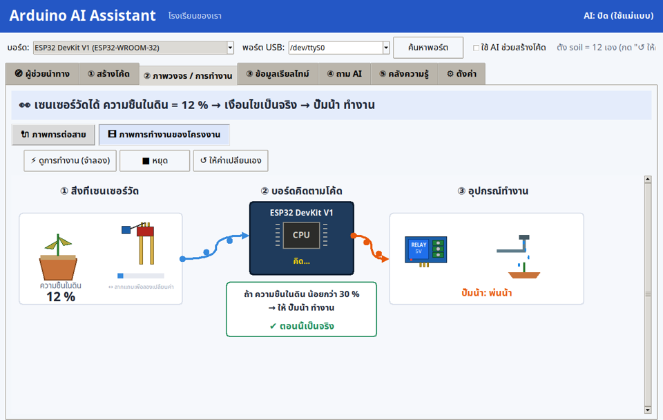
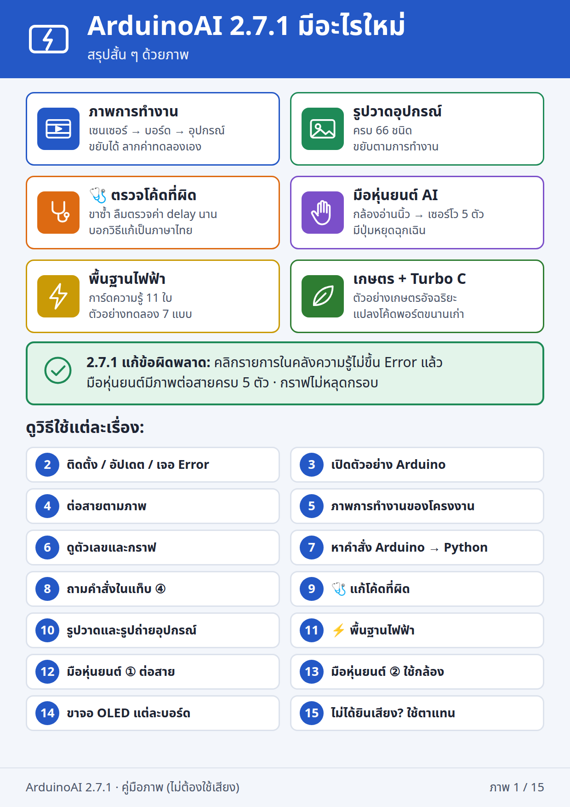
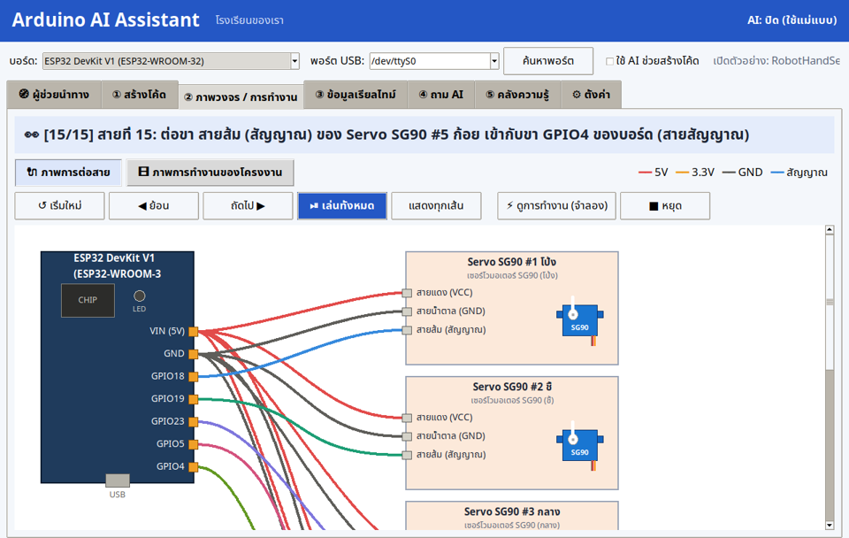
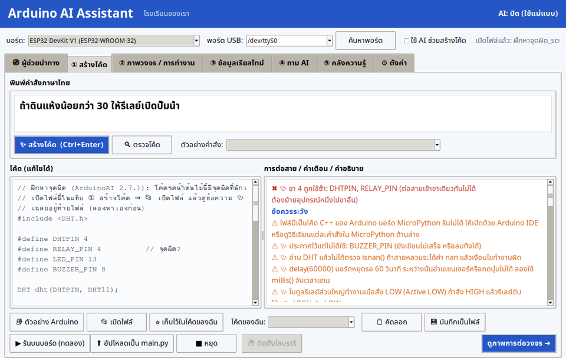

# Arduino AI Assistant — ผู้ช่วย AI สำหรับเรียนไมโครคอนโทรลเลอร์

โปรแกรมภาษาไทยสำหรับเรียน Arduino / ESP32 / Raspberry Pi Pico: พิมพ์คำสั่งภาษาไทย → ได้โค้ด MicroPython (หรือ C++) พร้อม **ภาพการต่อสาย** **ภาพการทำงานของโครงงาน** และ **กราฟเรียลไทม์** ใช้ได้แม้ยังไม่มีบอร์ด (โหมดจำลอง)

## ⬇ ดาวน์โหลด (ฟรี)

**[⬇ ดาวน์โหลด ArduinoAI เวอร์ชันล่าสุด (ไฟล์ zip)](https://github.com/chikannika-coder/ArduinoAI-Assistant/releases/latest/download/ArduinoAI.zip)**  ·  [คู่มือภาพ PDF 15 หน้า](https://github.com/chikannika-coder/ArduinoAI-Assistant/releases/latest/download/visual-guide-v2.7.1-th.pdf)  ·  [ทุกเวอร์ชัน](https://github.com/chikannika-coder/ArduinoAI-Assistant/releases)

1. ติดตั้ง **Python 3.10 ขึ้นไป** จาก [python.org](https://www.python.org/downloads/) — ตอนติดตั้งติ๊ก **Add Python to PATH**
2. แตกไฟล์ `ArduinoAI.zip` ไว้ที่ไหนก็ได้ (เช่น Documents) — ถ้าแตกทับของเดิม ให้เลือก **แทนที่ (Replace)**
3. ดับเบิลคลิก **`install.bat`** (ทำครั้งเดียว ต้องต่ออินเทอร์เน็ต)
4. ดับเบิลคลิก **`run.bat`** เพื่อเปิดโปรแกรม — แถบชื่อด้านบนต้องขึ้น **เวอร์ชัน 2.7.1**

ใช้ได้กับ Windows 10/11 · ใช้ได้ฟรีตามสัญญาอนุญาต [MIT](LICENSE) (โรงเรียนนำไปใช้ ดัดแปลง และแจกต่อได้ ขอให้ระบุที่มา)

## 🎒 สำหรับนักเรียน: เริ่มเรียนตรงไหนดี

| อยากทำอะไร | เปิดตรงไหน |
|---|---|
| ยังไม่มีบอร์ด อยากลองก่อน | แท็บ ① พิมพ์คำสั่ง เช่น `ถ้าดินแห้งน้อยกว่า 30 ให้รีเลย์เปิดปั๊มน้ำ` → แท็บ ② **🎞 ภาพการทำงานของโครงงาน** → ⚡ ดูการทำงาน (จำลอง) |
| มีบอร์ดแล้ว ทำทีละขั้น | แท็บ **🧭 ผู้ช่วยนำทาง** 6 ขั้น (ต่อบอร์ด → เลือกโปรเจกต์ → ต่อสาย → ตรวจสาย → รันโค้ด) |
| ดูตัวอย่างพร้อมใช้ 127 แบบ | ปุ่ม **📚 ตัวอย่าง Arduino** ในแท็บ ① (ใหม่: หมวด 18 มือหุ่นยนต์ AI, หมวด 19 พื้นฐานไฟฟ้า) |
| โค้ดของฉันผิดตรงไหน | แท็บ ① → **📂 เปิดไฟล์** → อ่านข้อความ 🩺 (ลองไฟล์ฝึก `my_code/ฝึกหาจุดผิด_รดน้ำต้นไม้.ino`) |
| คำสั่ง Arduino เขียนใน Python ยังไง | แท็บ ⑤ คลังความรู้ → **คำสั่ง Arduino → MicroPython** (ค้นด้วยคำไทยได้) หรือถามในแท็บ ④ |
| เรียนพื้นฐานไฟฟ้า | แท็บ ⑤ → **⚡ พื้นฐานไฟฟ้า** (การ์ด 11 ใบ) + ตัวอย่างหมวด 19 (7 การทดลอง) |

## 🖐 เอกสารฉบับภาพ (สำหรับนักเรียนที่มีความบกพร่องทางการได้ยิน และทุกคน)

ทุกขั้นตอนมีเลขและกรอบแดงชี้จุดที่ต้องกด ไม่มีข้อมูลที่ต้องฟัง

| เอกสาร | เนื้อหา |
|---|---|
| **[คู่มือภาพ 2.7.1 (PDF 15 หน้า)](คู่มือภาพ/คู่มือภาพ_ArduinoAI_2.7.1_ทั้งชุด.pdf)** · [ภาพแยกไฟล์](คู่มือภาพ/) | ติดตั้ง/อัปเดต/เจอ Error, เปิดตัวอย่าง, ต่อสาย, ภาพการทำงาน, ตัวเลขและกราฟ, หาคำสั่ง, ถาม AI, 🩺 แก้โค้ดที่ผิด, รูปอุปกรณ์, พื้นฐานไฟฟ้า, มือหุ่นยนต์ (ต่อสาย / ใช้กล้อง), ขาจอ OLED, ไม่ได้ยินเสียง? ใช้ตาแทน |
| [คู่มือติดตั้งโปรแกรม ฉบับภาพ (PDF 8 หน้า)](docs/install-guide-visual-th.pdf) | ติดตั้ง Python, แตกไฟล์, ติดตั้งโปรแกรม, ลง MicroPython, ต่อบอร์ด, แก้ปัญหา |
| [รู้จักระบบ ฉบับภาพ (PDF 11 หน้า)](docs/system-guide-visual-th.pdf) | การทำงานของระบบ, ผู้ช่วยนำทาง 6 ขั้น, อ่านภาพวงจร, ข้อมูลเรียลไทม์, กฎความปลอดภัย, คำศัพท์ |
| [ของใหม่ในเวอร์ชัน 2.3 (PDF 7 หน้า)](docs/visual-guide-v2.3-th.pdf) | ฉบับเก่า เก็บไว้อ้างอิง |

## มีอะไรใหม่ในเวอร์ชัน 2.7.1 (28 ก.ย. 2569)

| มือหุ่นยนต์ AI: ภาพต่อสายเซอร์โว 5 ตัว | 🩺 ตรวจโค้ดหาจุดที่มักเขียนผิด |
|---|---|
|  |  |

- **มือหุ่นยนต์ AI ควบคุมด้วยกล้อง** (2.7) — หน้าเว็บอ่านนิ้วด้วย MediaPipe ส่งมุมไปเซอร์โว 5 ตัว ผ่านสาย USB หรือ Wi-Fi มีปุ่มหยุดฉุกเฉิน และมือกางเองเมื่อสัญญาณหาย (Fail-safe) แก้ปัญหาเดิมที่หน้าเว็บกับโค้ดบอร์ดส่งคำสั่งคนละแบบจนมือไม่ขยับ
- **⚡ พื้นฐานไฟฟ้า** (2.7) — การ์ดความรู้ 11 ใบ และตัวอย่างทดลอง 7 แบบ (ทดสอบตัวนำ-ฉนวน, รหัสมอร์ส, วัดแรงดันถ่าน, เกมมือนิ่ง, สัญญาณกันขโมย, วัดความต้านทาน, แม่เหล็กไฟฟ้า)
- **ภาพการทำงานของโครงงาน + รูปวาดอุปกรณ์ 66 ชนิด** (2.6) — เห็นว่าเซนเซอร์วัดอะไร → บอร์ดคิดอย่างไร → อุปกรณ์ทำอะไร ลากค่าทดลองเองได้
- **เกษตรอัจฉริยะ + Turbo C** (2.4–2.5) — หุ่นยนต์บีม, ตัวอย่างเกษตร 11 แบบ, แปลงโค้ดพอร์ตขนานเก่าเป็น MicroPython, 🩺 ตรวจโค้ด
- **2.7.1 แก้ข้อผิดพลาด** — คลิกรายการในคลังความรู้ไม่ขึ้น Error แล้ว, ตัวอย่างมือหุ่นยนต์และ LED 6 ดวงมีภาพต่อสาย, กราฟไม่หลุดกรอบ, คู่มือภาพอัปเดตเป็น 15 หน้า

รายละเอียดทั้งหมดและประวัติทุกเวอร์ชันอยู่ใน **[README_TH.md](README_TH.md)** (คู่มือฉบับเต็ม)

## ⚠ ความปลอดภัย

- ห้ามต่อไฟบ้าน 220V เข้ารีเลย์โดยไม่มีครูดูแล · การทดลองไฟฟ้าใช้ถ่านไฟฉายหรือไฟจากบอร์ดเท่านั้น
- มือหุ่นยนต์: ต้องมีคนเฝ้าข้างหุ่นพร้อมกดหยุดเสมอ เซอร์โว 5 ตัวใช้แหล่งจ่าย 5V แยก และต่อ GND ร่วม
- ไฟล์ `config.json` เก็บ API Key ของครู **ห้ามอัปโหลดขึ้น GitHub** (มีอยู่ใน `.gitignore` แล้ว)

## ที่มาของเนื้อหา

- ตัวอย่าง Arduino จาก Arduino IDE 1.6.0 (สาธารณสมบัติตามที่ระบุในไฟล์ต้นฉบับ) แปลเป็นภาษาไทยและแปลงเป็น MicroPython
- การ์ดคณิตศาสตร์อิงแนวคิดจาก *Mathematics for Computer Science* (MIT, CC BY-SA 3.0) เรียบเรียงใหม่เป็นภาษาไทย
- หัวข้อพื้นฐานไฟฟ้าอิงแนวทาง *Learning Through Science: Electricity* (Schools Council, 1983) — เนื้อหาและโค้ดเขียนขึ้นใหม่ทั้งหมด ไม่ได้คัดลอกหรือแนบหนังสือ
- โค้ดมือหุ่นยนต์ต้นฉบับจากผลงานนักเรียน (`arduino_examples/18.RobotHand/RobotHandSerial/pan_robot_hand2_original.ino`) เก็บไว้พร้อมฉบับที่แก้แล้ว
- ไม่ได้แนบไฟล์ติดตั้ง Tailscale ดาวน์โหลดได้ที่ [tailscale.com/download](https://tailscale.com/download)

## สำหรับครู / ผู้พัฒนา

- ตรวจว่าทุกอย่างทำงาน: `py -3 test_examples.py` · `py -3 test_generator.py` · `py -3 test_visuals.py`
- เพิ่มอุปกรณ์: แท็บ ⑤ → ➕ เพิ่มอุปกรณ์ใหม่ (แนบรูป/ข้อความให้ AI วิเคราะห์ได้) หรือแก้ `knowledge/components.json`
- เพิ่มตัวอย่าง: วางไฟล์ `.ino` / `.py` ใน `arduino_examples/<หมวด>/<ชื่อ>/` แล้วเพิ่มรายการใน `arduino_examples/index.json` (วิธีเขียนหัวไฟล์ `# แผนขา:` `# ขา:` `# ขาเพิ่ม:` ดูใน `examples_lib.py`)
